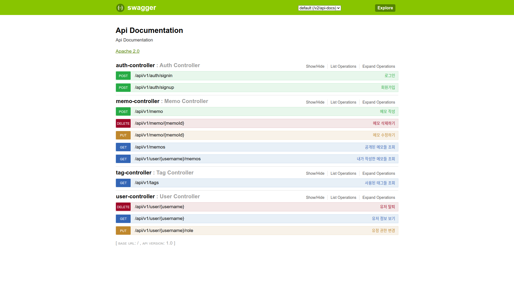

# Kotlin Spring Boot Memo

memo application with spring boot



## Setup

1. Setup Mysql
  * Instal Mysql 8.0
  * Create Mysql User
    * user: incubus
    * password: dream
  * Create Database
    * database name: incubating

2. Build
```
./gradlew build
```

## Run

```
java -jar build/libs/*.jar
```

Open [http://localhost:8080/swagger.html](http://localhost:8080/swagger.html)
